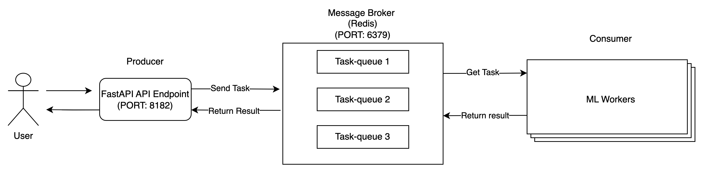
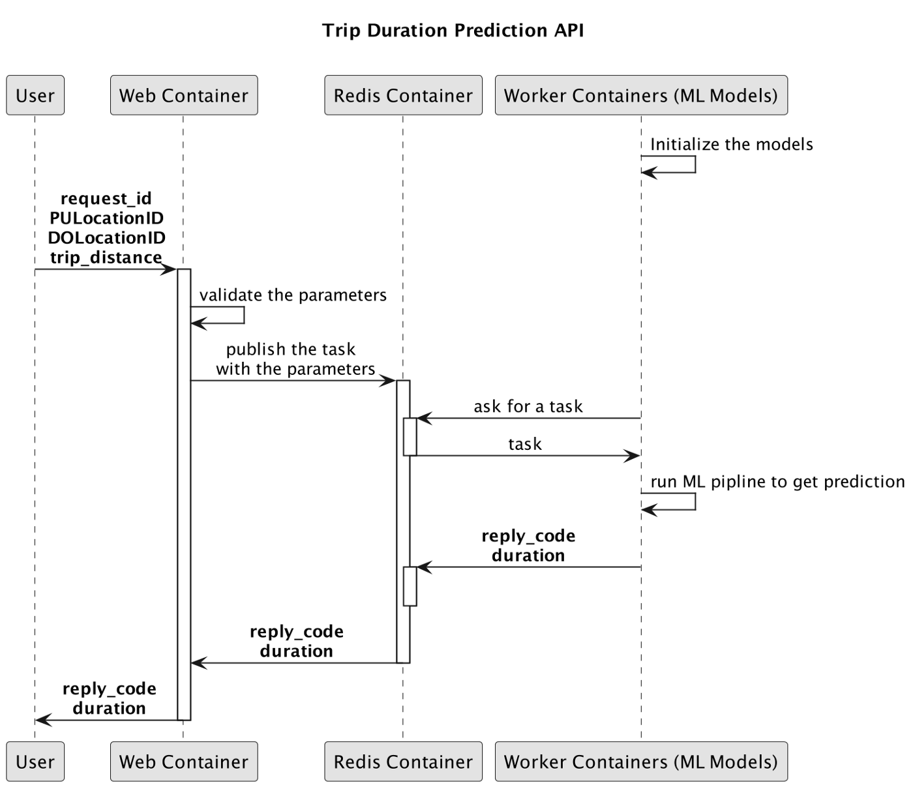

# ML Demo API using Celery and FastAPI


This repo provides the implementation of REST API running ML using Celery and FastAPI. 
For detail explaination, can take a look in the Medium blog: [Deploy ML models as A Task Queue Distributed Service with Python and Celery](https://medium.com/@vmthanhit/deploy-ml-models-as-a-task-queue-distributed-service-with-python-and-celery-5a5bae82240f)
## Required Library
- Docker
- Docker Compose
- Make 
- Conda

## Usage

### Install new conda environment 
```
conda create --name demo_api_with_celery python=3.9
conda activate demo_api_with_celery
```

### Install Pipenv
```
pip install --user pipenv
```

### Activate Pipenv 
```
make init
```

### Build & Run Docker Images
```
make build 
make up
```
### Test the application

#### Unit Test
```
make test
```

#### Access the website
We can visit: [http://localhost:8182/docs](http://localhost:8182/docs) in our browser to see the interactive API documentation provided by Swagger UI

#### Terminate application
```
make down
```

## Code Architecture & Structure




```
.
├── Makefile
├── Pipfile
├── Pipfile.lock
├── README.md
├── apps
│   └── api
│       ├── api_routers.py
│       └── main.py
├── boot
│   ├── docker
│   │   ├── celery
│   │   │   ├── cuda90.yml
│   │   │   └── trip
│   │   │       ├── Dockerfile
│   │   │       └── entrypoint.sh
│   │   ├── compose
│   │   │   └── trip_duration_prediction
│   │   │       ├── docker-compose.cpu.yml
│   │   │       ├── docker-compose.dev.yml
│   │   │       ├── docker-compose.yml
│   │   │       ├── docker-services.sh
│   │   │       └── my_build.sh
│   │   └── uvicorn
│   │       ├── Dockerfile
│   │       ├── entrypoint.sh
│   │       └── requirements.txt
│   └── uvicorn
│       └── config.py
├── config.py
├── core
│   ├── managers
│   ├── schemas
│   │   ├── api_base.py
│   │   ├── health.py
│   │   └── trip.py
│   ├── services
│   │   ├── trip_duration_api.py
│   │   └── trip_duration_prediction_task.py
│   └── utilities
│       ├── cls_constants.py
│       ├── cls_gpu.py
│       ├── cls_loguru_config.py
│       ├── cls_redis.py
│       ├── cls_time.py
│       ├── cls_type.py
│       └── dec_exc.py
├── pyproject.toml
├── repo
│   ├── logs
│   │   ├── apps
│   │   │   └── api
│   │   └── tasks
│   │       └── trip
│   └── models
│       └── lin_reg.bin
├── tasks
│   └── trip
│       └── tasks.py
└── tests
    ├── http_test
    │   └── test_api.py
    └── model_test
        └── test_trip_prediction_task.py
```

## Logs Files
All running log files can be found in **repo/logs**

## Model Weights
Model weights can be found in **repo/models**

## References
- [https://medium.com/cuddle-ai/async-architecture-with-fastapi-celery-and-rabbitmq-c7d029030377](https://medium.com/cuddle-ai/async-architecture-with-fastapi-celery-and-rabbitmq-c7d029030377)
- [https://github.com/celery/celery](https://github.com/celery/celery)
- [https://medium.com/analytics-vidhya/deploying-your-machine-learning-model-as-a-rest-api-using-flask-c2e6a0b574f5](https://medium.com/analytics-vidhya/deploying-your-machine-learning-model-as-a-rest-api-using-flask-c2e6a0b574f5)
- [https://ljvmiranda921.github.io/notebook/2019/11/08/flask-redis-celery-mcdo/](https://ljvmiranda921.github.io/notebook/2019/11/08/flask-redis-celery-mcdo/)
- [https://www.youtube.com/watch?v=D7wfMAdgdF8&list=PL3MmuxUbc_hIUISrluw_A7wDSmfOhErJK&index=29](https://www.youtube.com/watch?v=D7wfMAdgdF8&list=PL3MmuxUbc_hIUISrluw_A7wDSmfOhErJK&index=29)
- [https://fastapi.tiangolo.com/](https://fastapi.tiangolo.com/)

